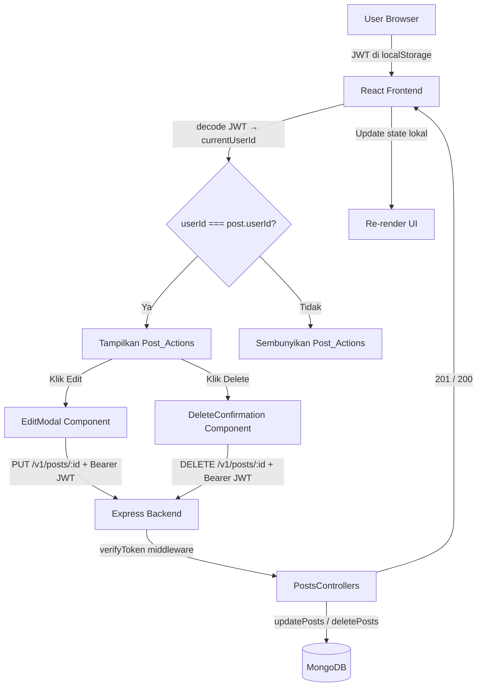

# Design Document: Edit & Delete Post oleh Pemilik (UI)

## Overview

Fitur ini menambahkan kemampuan bagi pengguna untuk mengedit dan menghapus post milik mereka sendiri pada aplikasi social media/blog berbasis React + Node.js/Express + MongoDB.

Dua operasi utama:
- **Edit**: Post_Owner membuka modal inline, mengubah body post, lalu menyimpan. UI diperbarui secara lokal tanpa reload.
- **Delete**: Post_Owner mengklik Delete, mengonfirmasi melalui dialog, lalu post dihapus dari UI secara lokal.

Tombol aksi (Edit & Delete) hanya ditampilkan kepada pemilik post, diidentifikasi dengan membandingkan `userId` dari JWT decode dengan `userId` pada data post. Backend sudah menyediakan endpoint `PUT /v1/posts/:id` dan `DELETE /v1/posts/:id` — namun pengecekan ownership pada `deletePosts` perlu diaktifkan kembali.

---

## Architecture



**Alur ownership check:**
1. Saat komponen dirender, token di-decode dengan `jwtDecode` → ambil `currentUserId`.
2. Setiap post dibandingkan: `post.userId === currentUserId`.
3. Jika cocok → render `<PostActions>`. Jika tidak → render null.

**State management:** Semua update dilakukan secara lokal pada state React (`posts` array di Home, `body` state di DetailPosts) tanpa memanggil ulang `GET /v1/posts`.

---

## Components and Interfaces

### Komponen Baru

#### `PostActions` (`client/src/components/PostActions.jsx`)

Komponen presentasional yang merender tombol Edit dan Delete. Hanya dirender jika `isOwner === true`.

```jsx
// Props
{
  postId: string,          // ID post
  isOwner: boolean,        // apakah current user adalah pemilik
  onEdit: () => void,      // callback buka EditModal
  onDelete: () => void,    // callback buka DeleteConfirmation
}
```

#### `EditModal` (`client/src/components/EditModal.jsx`)

Modal overlay untuk mengedit body post.

```jsx
// Props
{
  postId: string,
  initialBody: string,
  onSave: (postId: string, newBody: string) => Promise<void>,
  onClose: () => void,
}

// Internal state
{
  body: string,       // nilai textarea
  error: string,      // pesan error validasi / API error
  loading: boolean,   // request in-flight
}
```

#### `DeleteConfirmation` (`client/src/components/DeleteConfirmation.jsx`)

Dialog konfirmasi sebelum menghapus post.

```jsx
// Props
{
  postId: string,
  onConfirm: (postId: string) => Promise<void>,
  onClose: () => void,
}

// Internal state
{
  error: string,      // pesan error API
  loading: boolean,   // request in-flight
}
```

### Modifikasi Komponen Existing

#### `Home` (`client/src/pages/home/index.jsx`)

Tambahan state dan handler:
```js
const [currentUserId, setCurrentUserId] = useState(null);
const [editingPost, setEditingPost] = useState(null);   // { id, body } | null
const [deletingPostId, setDeletingPostId] = useState(null); // string | null

// Handler
const handleEditSave = async (postId, newBody) => { /* PUT + update state lokal */ }
const handleDeleteConfirm = async (postId) => { /* DELETE + filter state lokal */ }
```

#### `DetailPosts` (`client/src/pages/detail/detailPosts.jsx`)

Tambahan state dan handler:
```js
const [currentUserId, setCurrentUserId] = useState(null);
const [postId, setPostId] = useState(null);
const [showEditModal, setShowEditModal] = useState(false);
const [showDeleteConfirm, setShowDeleteConfirm] = useState(false);

const handleEditSave = async (id, newBody) => { /* PUT + setBody(newBody) */ }
const handleDeleteConfirm = async (id) => { /* DELETE + navigate('/') */ }
```

### API Client (axios calls)

```js
// Edit post
axios.put(`${REACT_APP_URL}/v1/posts/${postId}`, { body }, {
  headers: { Authorization: `Bearer ${token}` }
})

// Delete post
axios.delete(`${REACT_APP_URL}/v1/posts/${postId}`, {
  headers: { Authorization: `Bearer ${token}` }
})
```

> Catatan: Route di `PostsRoutes.js` menggunakan `router.patch` namun controller `updatePosts` sudah benar. Perlu diubah ke `router.put` agar konsisten dengan requirement, atau frontend menggunakan `axios.patch`. Desain ini menggunakan `axios.patch` untuk menyesuaikan route yang ada.

---

## Data Models

### Post (existing, dari MongoDB)

```js
{
  _id: ObjectId,
  userId: ObjectId,   // referensi ke Users — digunakan untuk ownership check
  author: [String],
  image: String,
  body: String,       // field yang diedit
  date: Date,
  comments: [ObjectId]
}
```

### JWT Payload (existing, dari `jwtDecode`)

```js
{
  id: string,       // digunakan sebagai currentUserId
  username: string,
  role: string,
  image: string,
  iat: number,
  exp: number
}
```

### State Shape di Home

```js
posts: Array<{
  _id: string,
  userId: string,
  author: string[],
  image: string,
  body: string,
  comments: Array<{ _id, body, author }>
}>

currentUserId: string | null
editingPost: { id: string, body: string } | null
deletingPostId: string | null
```

### State Shape di DetailPosts

```js
body: string
author: string
imageAuthor: string
currentUserId: string | null
postId: string | null
showEditModal: boolean
showDeleteConfirm: boolean
```

---

## Correctness Properties

*A property is a characteristic or behavior that should hold true across all valid executions of a system — essentially, a formal statement about what the system should do. Properties serve as the bridge between human-readable specifications and machine-verifiable correctness guarantees.*

### Property 1: Ownership filtering — hanya post milik sendiri yang menampilkan Post_Actions

*For any* array post dengan userId yang bervariasi dan satu `currentUserId`, komponen yang merender daftar post hanya boleh menampilkan `PostActions` pada post yang `userId`-nya sama dengan `currentUserId`, dan tidak menampilkannya pada post lain.

**Validates: Requirements 1.1, 1.2, 1.4**

---

### Property 2: Edit modal pre-populated dengan body post

*For any* post dengan nilai `body` yang valid (string non-empty), ketika tombol Edit diklik, `EditModal` harus ditampilkan dengan nilai textarea yang sama persis dengan `body` post tersebut, beserta tombol "Save" dan "Cancel".

**Validates: Requirements 2.1, 2.2**

---

### Property 3: Cancel edit tidak mengubah post

*For any* post, membuka `EditModal` kemudian mengklik "Cancel" harus menutup modal tanpa mengubah nilai `body` post di state maupun memanggil API.

**Validates: Requirements 2.3**

---

### Property 4: Validasi input kosong pada edit

*For any* string yang kosong atau hanya terdiri dari whitespace, mengklik "Save" pada `EditModal` harus menampilkan pesan error dan tidak mengirim request ke API.

**Validates: Requirements 2.4**

---

### Property 5: Edit berhasil memperbarui UI secara lokal

*For any* post dan nilai `body` baru yang valid, setelah request `PUT /v1/posts/:id` berhasil (status 201), `EditModal` harus tertutup dan body post di state UI harus sama dengan nilai baru yang disimpan — tanpa memanggil ulang `GET /v1/posts`.

**Validates: Requirements 2.5, 2.6, 4.1, 4.3**

---

### Property 6: Delete confirmation muncul dengan pesan irreversibility

*For any* post milik current user, mengklik tombol "Delete" harus menampilkan `DeleteConfirmation` yang berisi pesan bahwa tindakan tidak dapat dibatalkan, beserta tombol "Confirm Delete" dan "Cancel".

**Validates: Requirements 3.1, 3.2**

---

### Property 7: Cancel delete tidak mengubah post

*For any* post, membuka `DeleteConfirmation` kemudian mengklik "Cancel" harus menutup dialog tanpa mengubah state posts maupun memanggil API.

**Validates: Requirements 3.3**

---

### Property 8: Delete berhasil menghapus post dari state lokal

*For any* array posts yang berisi post dengan id tertentu, setelah request `DELETE /v1/posts/:id` berhasil (status 200), post tersebut tidak boleh lagi ada di array state `posts` — tanpa memanggil ulang `GET /v1/posts`.

**Validates: Requirements 3.4, 3.5, 4.2**

---

### Property 9: Tombol submit disabled saat request in-flight

*For any* operasi edit atau delete yang sedang diproses (loading state = true), tombol "Save" atau "Confirm Delete" harus dalam kondisi `disabled` untuk mencegah pengiriman request duplikat.

**Validates: Requirements 4.4**

---

### Property 10: Backend authorization — userId tidak cocok menghasilkan 403

*For any* request `DELETE /v1/posts/:id` di mana `userId` pada JWT token tidak sama dengan `userId` pada post, controller `deletePosts` harus mengembalikan status 403.

**Validates: Requirements 5.1, 5.2**

---

## Error Handling

### Frontend

| Kondisi | Komponen | Pesan |
|---|---|---|
| Textarea kosong/whitespace saat Save | EditModal | "Body post tidak boleh kosong" |
| PUT mengembalikan 403 | EditModal | "Anda tidak memiliki izin untuk mengedit post ini" |
| PUT mengembalikan error lain | EditModal | "Terjadi kesalahan. Silakan coba lagi." |
| DELETE mengembalikan 404 | DeleteConfirmation | "Post tidak ditemukan" |
| DELETE mengembalikan error lain | DeleteConfirmation | "Terjadi kesalahan. Silakan coba lagi." |
| Token tidak ada di localStorage | Home / DetailPosts | Post_Actions tidak dirender (tidak ada error message) |

**Pola error handling di komponen:**
```js
try {
  setLoading(true);
  await axios.put(...);
  onSave(postId, newBody); // update state parent
  onClose();
} catch (err) {
  const status = err.response?.status;
  if (status === 403) setError("Anda tidak memiliki izin untuk mengedit post ini");
  else setError("Terjadi kesalahan. Silakan coba lagi.");
} finally {
  setLoading(false);
}
```

### Backend

- `updatePosts`: Sudah mengembalikan 403 jika `post.userId.toString() != req.userId`, 404 jika post tidak ditemukan.
- `deletePosts`: Perlu mengaktifkan kembali pengecekan ownership (uncomment blok yang di-comment). Setelah diperbaiki, mengembalikan 403 jika userId tidak cocok, 404 jika post tidak ditemukan.
- `verifyToken` middleware: Mengembalikan 401 jika token tidak ada, 403 jika token invalid.

---

## Testing Strategy

### Pendekatan Dual Testing

Fitur ini menggunakan dua lapisan pengujian yang saling melengkapi:

1. **Unit/Component Tests** — contoh spesifik, edge case, error conditions
2. **Property-Based Tests** — properti universal yang berlaku untuk semua input

Library yang digunakan:
- **React Testing Library** + **Jest** untuk component tests
- **fast-check** untuk property-based testing (minimum 100 iterasi per property)

---

### Property-Based Tests

Setiap property test harus diberi tag komentar dengan format:
`// Feature: edit-delete-post-ui, Property {N}: {property_text}`

| Property | Test | fast-check Arbitraries |
|---|---|---|
| P1: Ownership filtering | Generate array post dengan userId acak + currentUserId acak, verifikasi hanya post yang cocok menampilkan PostActions | `fc.array(fc.record({ _id: fc.string(), userId: fc.string(), body: fc.string() }))` |
| P2: Edit modal pre-populated | Generate string body acak, klik Edit, verifikasi textarea value === body | `fc.string({ minLength: 1 })` |
| P3: Cancel edit tidak mengubah post | Generate post acak, buka modal, cancel, verifikasi body tidak berubah | `fc.record({ _id: fc.string(), body: fc.string({ minLength: 1 }) })` |
| P4: Validasi input kosong | Generate string whitespace-only, verifikasi error muncul dan API tidak dipanggil | `fc.stringOf(fc.constantFrom(' ', '\t', '\n'))` |
| P5: Edit berhasil update UI lokal | Generate post + newBody, mock PUT 201, verifikasi state diupdate tanpa GET call | `fc.tuple(fc.string({ minLength: 1 }), fc.string({ minLength: 1 }))` |
| P6: Delete confirmation content | Generate post milik current user, klik Delete, verifikasi dialog muncul dengan konten yang benar | `fc.record({ _id: fc.string(), userId: fc.string() })` |
| P7: Cancel delete tidak mengubah post | Generate array posts, buka konfirmasi, cancel, verifikasi array tidak berubah | `fc.array(fc.record({ _id: fc.string(), userId: fc.string() }), { minLength: 1 })` |
| P8: Delete berhasil hapus dari state | Generate array posts, mock DELETE 200, verifikasi post hilang dari array | `fc.array(fc.record({ _id: fc.string() }), { minLength: 1 })` |
| P9: Tombol disabled saat loading | Saat loading=true, verifikasi tombol Save/Confirm Delete disabled | Tidak perlu arbitrary — state langsung diset |
| P10: Backend 403 jika userId tidak cocok | Generate dua userId berbeda, verifikasi deletePosts return 403 | `fc.tuple(fc.string({ minLength: 1 }), fc.string({ minLength: 1 })).filter(([a, b]) => a !== b)` |

**Konfigurasi fast-check:**
```js
fc.assert(fc.property(...), { numRuns: 100 });
```

---

### Unit/Example Tests

| Skenario | Tipe | Requirement |
|---|---|---|
| Tidak ada token → Post_Actions tidak muncul | Example | 1.3 |
| PUT return 403 → pesan error spesifik di EditModal | Example | 2.7 |
| PUT return 500 → pesan error generik di EditModal | Edge Case | 2.8 |
| DELETE return 404 → pesan error spesifik di DeleteConfirmation | Example | 3.7 |
| DELETE return 500 → pesan error generik di DeleteConfirmation | Edge Case | 3.8 |
| DELETE berhasil di DetailPosts → navigate('/') dipanggil | Example | 3.6 |
| deletePosts controller — ownership check aktif (smoke) | Smoke | 5.3 |

---

### Integration Tests

Tidak diperlukan integration test terpisah untuk fitur ini karena semua logika diuji melalui unit/property tests dengan mock axios. End-to-end behavior dapat diverifikasi secara manual atau melalui E2E test (Cypress/Playwright) di luar scope spec ini.
